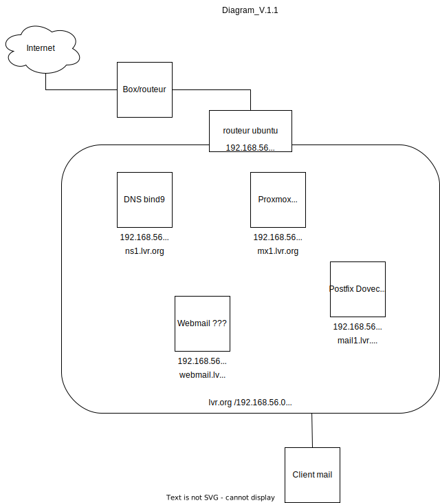

***
# projet_dawan
***

***
## Introduction
Ce dépôt est créé pour y déposer mon projet de fin de formation POEC d'Admin Sytèmes et Réseaux Cloud.  
Cette formation d'un peu moins de 3 mois a été dispensée par [](https://www.dawan.fr/)  
Le programme y était complet, peut être un peu trop, sur une période relativement courte !  
Cette formation mériterait d'avoir une durée au moins doublée...

Pour cette fin de formation, je propose de déployer une infrastructure mail dans Virtualbox avec :
- un routeur  
- un serveur proxmox mail gateway  
- un serveur dns  
- un serveur mail  
- et un serveur webmail.

Le but de ce déploiement est de l'automatiser avec **Vagrant** et **Ansible** pour pouvoir le redéployer rapidement.
***
## Etapes
***
### Etape 1

Le serveur servant de routeur et celui pour proxmox non pas été automatisés.
***
1. **Pour le routeur :**

C'est une VM avec 2 interfaces réseaux :  
   - une en mode pont pour faire le lien vers la box  
   - et une en réseau privé qui servira de passerelle pour le réseau privé.

Sur cette VM est installée **Ubuntu server 22.04** pour laquelle il y a très peu de configuration :  
   - Modification du fichier `/etc/sysctl.conf` en y décommentant cette ligne  
```
net.ipv4.ip_forward=1
```
   - Ensuite, appliquer la modification avec la commande `sysctl -p`.  
   - Ajouter une règle de NAT dans `iptables`:  
```
iptables -t nat -A POSTROUTING -o <nom_int_reseau_mode_pont> -j MASQUERADE
```
   - Et installer le paquet iptables-persistent pour rendre persistant cette règle :  
```
apt install iptables-persistent
```
***
2. **Pour PMG : Proxmox Mail Gateway :** mx1.lvr.org / 192.168.56.100

**Proxmox Mail Gateway** est une solution de sécurité de messagerie open source qui vous aide à protéger votre serveur de messagerie contre toutes les menaces de messagerie dès leur apparition. L'architecture flexible combinée à l'interface de gestion Web conviviale permet de contrôler facilement tous les e-mails entrants et sortants et de protéger leurs utilisateurs contre les spams, les virus, le phishing et les chevaux de Troie.

PMG est une distribution linux dans laquelle tous ses services sont installés et pré-configurés.  
La VM est donc déployée avec cette iso :  
   - proxmox-mailgateway_7.2-1.iso téléchargée sur le site officiel de [Proxmox](https://www.proxmox.com/en/downloads)

Après l'installation, se connecter à l'interface web du serveur pour configurer la solution en fonction de sa propre infrastrucute, en suivant la documentation.
***
### Etape 2

Dans cette étape, les serveurs dns, mail et webmail vont être déployés et automatisés.

Le déploiement des VMs se fait avec **Vagrant** et la configuration des services se fait avec **Ansible**.

J'ai d'abord travaillé sur chaque VM séparément.  
J'ai glané sur internet des rôles ansible qui pouvaient convenir à l'infrastructure que je voulais mettre en place.  
Après les avoir décortiqués, je les ai façonnés à ma manière pour que le résulat corresponde à ce que j'attendais !

Les deux rôles récupérés pour le dns et le serveur mail ont été modifiés car trop complexes au départ.  
Ils présentaient trop de posibilités par rapport à mon *petit* projet :)  
J'ai donc supprimé des options, des automatisations variabilisées,... , enfin tout ce dont je n'avais pas besoin dans l'instant !  
J'y ai gardé quand même quelques éléments qui ne servent pas là dans ce projet mais qui pourraient être amenés à me servir si j'ai envie de faire quelques tests plus tard tout en partant de cette base...

Je vais développer rapidement ce que font mes *playbooks ansible* pour mettre en place cette infrastructure :
***
1. **dns :** ns1.lvr.org / 192.168.56.10

Le serveur dns définit ma zone **lvr.org**.

Le playbook permet :
   - L'installation de **bind9**
   - La configuration des fichiers essentiels dont :
      - `/etc/bind/named.conf.local`
      - `/etc/bind/named.conf.options`
      - `/etc/bind/db.lvr.org` pour le fichier de zone
      - `/etc/bind/db.192` pour la zone inversée

**Le but est d'obtenir ces résultats :**

```
#### /etc/bind/named.conf.local 
zone "lvr.org" {
        type master;
        file "/etc/bind/db.lvr.org";
        allow-query { any; };        
};
zone "56.168.192.in-addr.arpa" {
        type master;
        file "/etc/bind/db.192";
};
```
```
#### /etc/bind/named.conf.options 
 options {
        directory "/var/cache/bind";
         forwarders {
                192.168.56.10;
                8.8.8.8;
                8.8.4.4;
         };

        dnssec-validation auto;

        auth-nxdomain no;    # conform to RFC1035
        version none;
        forward only;
};
```
```
#### /etc/bind/db.lvr.org 
$TTL    604800
@       IN      SOA     ns1.lvr.org. root.lvr.org. (
                              2         ; Serial
                         604800         ; Refresh
                          86400         ; Retry
                        2419200         ; Expire
                         604800 )       ; Negative Cache TTL
;
@       IN      NS      ns1.lvr.org.
@       IN      MX      10      mx1.lvr.org.
ns1  IN   A  192.168.56.10
mx1     IN      A       192.168.56.100
mail1   IN      A       192.168.56.20
webmail IN      A       192.168.56.30
```
```
#### /etc/bind/db.192 
$TTL    604800
$ORIGIN 56.168.192.in-addr.arpa.
@       IN      SOA     ns1.lvr.org. root.lvr.org. (
                              2         ; Serial
                         604800         ; Refresh
                          86400         ; Retry
                        2419200         ; Expire
                         604800 )       ; Negative Cache TTL
;
@       IN      NS      ns1.lvr.org.
10      IN      PTR     ns1.lvr.org.
20      IN      PTR     mail1.lvr.org.
100     IN      PTR     mx1.lvr.org.
30      IN      PTR     webmail.lvr.org.
```
***
2. **mail :** mail1.lvr.org / 192.168.56.20

Le serveur de mail est un **postfix**, j'y ai ajouter **dovecot** pour l'**imap** qui n'était pas prévu au départ dans le rôle.

Le playbook permet :
   - L'installation de postfix, mailutils, libsasl2-2, sasl2-bin, libsasl2-modules, dovecot-imapd
   - L'activation et la configuration de `resolvectl` pour la conf dns
   - La création d'une 10zaine d'utilisateurs pour les tests
   - La configuration du fichier `/etc/dovecot/conf.d/10-mail.conf` pour que `mail_location =` corresponde avec `home_mailbox =` du fichier `/etc/postfix/main.cf`
   - La configuration des fichiers essentiels dont :
      - `/etc/postfix/main.cf`

**Le but est d'obtenir ces résultats :**

```
#### /etc/postfix/main.cf
home_mailbox = Maildir/
myorigin = lvr.org
smtpd_banner = $myhostname ESMTP $mail_name (Ubuntu)
biff = no
append_dot_mydomain = no
readme_directory = no
smtpd_tls_cert_file = /etc/ssl/certs/ssl-cert-snakeoil.pem
smtpd_tls_key_file = /etc/ssl/private/ssl-cert-snakeoil.key
smtpd_use_tls=yes
smtpd_tls_session_cache_database = btree:${data_directory}/smtpd_scache
smtp_tls_session_cache_database = btree:${data_directory}/smtp_scache
myhostname = mail1.lvr.org
default_database_type = hash
alias_maps = hash:/etc/aliases
alias_database = hash:/etc/aliases
mydestination = mail1, localhost.lvr.org, localhost, lvr.org
mynetworks = 127.0.0.0/8 [::ffff:127.0.0.0]/104 [::1]/128
mailbox_size_limit = 0
recipient_delimiter = +
inet_interfaces = all
inet_protocols = all
relayhost = mx1.lvr.org
smtpd_sasl_auth_enable = yes
smtpd_sasl_type = dovecot
smtpd_sasl_path = private/auth
smtpd_sasl_authenticated_header = yes
smtpd_client_restrictions =
   permit_mynetworks, permit_sasl_authenticated,
   sleep 1, reject_unauth_pipelining
smtpd_helo_restrictions = reject_invalid_helo_hostname
smtpd_sender_restrictions =
   reject_unlisted_sender, reject_unknown_sender_domain,
   permit_mynetworks, permit_sasl_authenticated,
   reject_non_fqdn_sender
smtpd_recipient_restrictions =
    reject_unlisted_recipient, reject_unknown_recipient_domain,
    permit_mynetworks, permit_sasl_authenticated,
    reject_non_fqdn_recipient,
    reject_unauth_destination
message_size_limit = 10240000
disable_vrfy_command = yes
```
***

3. **webmail :** webmail.lvr.org / 192.168.56.30

Le serveur de webmail est un **rainloop**, petit et simple à mettre en place.  
Pour son déploiement, je n'ai pas utilisé de rôle, j'ai seulement mis toutes les tâches dans un simple playbook.

Le playbook contient donc tous les tâches nécessaires au fonctionnement de rainloop :
```
---
- name: Conf webmail
  hosts: webmail
  become: true

  tasks:
    - name: Mise à jour de la liste des paquets
      apt:
        update_cache: yes

    - name: Installation des paquets requis
      apt:
        name:
          - apache2
          - mariadb-server
          - php7.4
          - libapache2-mod-php7.4
          - php7.4-json
          - php7.4-curl
          - php7.4-mysql
          - php7.4-xml
          - php7.4-zip
          - php7.4-imap
          - wget
          - unzip
        state: present
        update_cache: yes

    - name: Création du répertoire de l'application
      file:
        path: /var/www/rainloop
        state: directory

    - name: Téléchargement de RainLoop
      get_url:
        url: https://repository.rainloop.net/installer.php
        dest: /var/www/rainloop/installer.php

    - name: Installation de RainLoop
      command: php /var/www/rainloop/installer.php

    - name: Attribution des permissions appropriées
      file:
        path: /var/www/rainloop
        state: directory
        owner: www-data
        group: www-data
        mode: '0755'
        recurse: yes

    - name: Modifier les valeurs dans le fichier de configuration PHP
      lineinfile:
        path: /etc/php/7.4/apache2/php.ini
        regexp: "{{ item.regexp }}"
        line: "{{ item.line }}"
      with_items:
        - { regexp: '^max_execution_time\s*=\s*\d+', line: 'max_execution_time = 300' }
        - { regexp: '^memory_limit\s*=\s*\d+[MG]', line: 'memory_limit = 512M' }
        - { regexp: '^upload_max_filesize\s*=\s*\d+[MG]', line: 'upload_max_filesize = 100M' }
        - { regexp: '^;date.timezone\s*=', line: 'date.timezone = Europe/Paris' }

    - name: Copier le fichier de configuration du virtualhost
      template:
        src: rainloop.conf.j2
        dest: /etc/apache2/sites-available/rainloop.conf
        mode: '0644'

    - name: Désactiver le site par défaut
      command: sudo a2dissite 000-default.conf
      ignore_errors: yes

    - name: Activer le site RainLoop
      command: sudo a2ensite rainloop.conf
      notify:
        - Restart Apache

    - name: Activer le module Apache pour le rewrite
      command: sudo a2enmod rewrite
      notify:
        - Restart Apache

  handlers:
    - name: Restart Apache
      service:
        name: apache2
        state: restarted
```
Il ne reste plus qu'à se connecter à son interface web : **webmail.lvr.org/?admin** pour le configurer et le tour est joué !
***

### Etape 3
